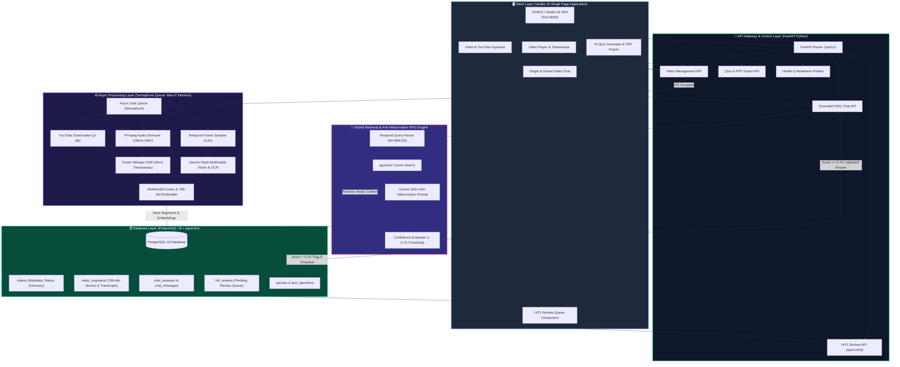
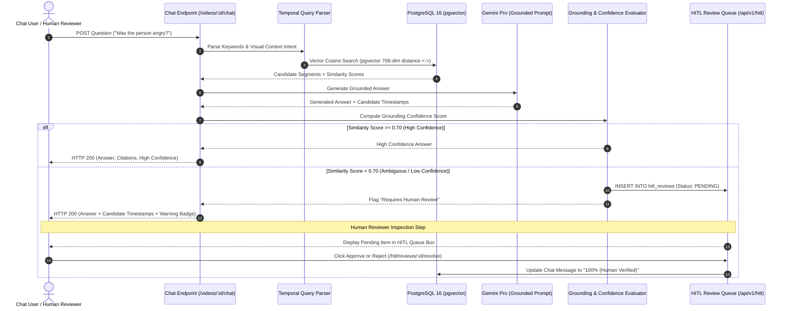
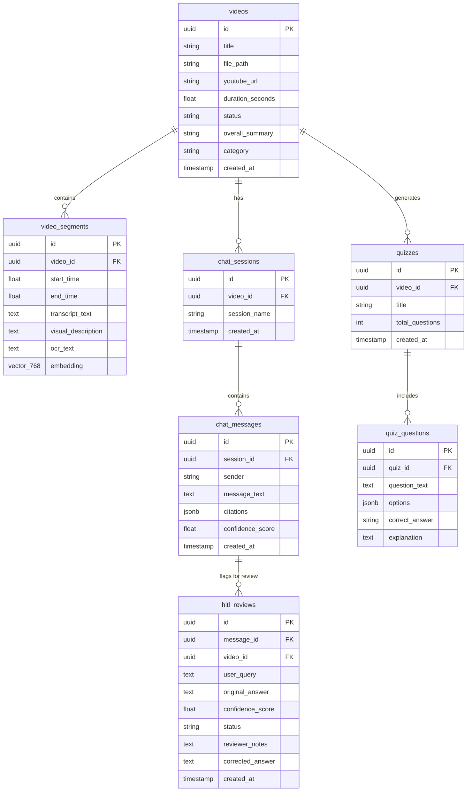

# System Architecture & Technical Design

## 1. Overview & Core Philosophy

**AI Video Analyser & Chat** is an independently deployable Python microservice built for high-throughput, multi-user video ingestion, multimodal perception, grounded conversational question answering, and **Human-in-the-Loop (HITL)** quality control.

Engineering Posture:
- **Frontend**: HTML5 / Vanilla JavaScript Single Page Application (SPA) featuring a 3-column workspace (Video Library, Synced Video Player & Quiz Generator, Multi-turn Chat & **HITL Review Queue**).
- **Backend**: Async non-blocking FastAPI (Python 3.10+).
- **Storage**: ACID transactional storage in **PostgreSQL 16** with vector similarity indexing (`pgvector`).
- **Processing**: Async worker queue with FFmpeg audio demuxing, Faster-Whisper ASR, Gemini Flash Vision & OCR, and 768-dim normalized embedding vectors (`text-embedding-004`).
- **RAG & HITL Engine**: Grounded retrieval with timestamp citations ($MM:SS$), anti-hallucination guardrails, and automated low-confidence ($< 0.70$) routing to the **HITL Review Queue**.

---

## 2. System Architecture Diagrams

### 2.1 System Component & Data Flow Architecture (C4 Model Level 2)

### 2.2 Grounded RAG & Confidence-Driven HITL Sequence Diagram

### 2.3 Enterprise Database ER Schema (PostgreSQL 16 + pgvector)

---

## 3. Key Design Decisions & Trade-Offs

### 3.1 PostgreSQL + Unified Vector Index vs. Dual Database
- Standardized on **PostgreSQL 16**. A single database handles relational metadata, job states, session history, HITL reviews, and 768-dimensional normalized embeddings via `pgvector`.

### 3.2 Confidence-Driven HITL (Human-in-the-Loop) Architecture
- Queries scoring below `0.70` confidence or identified as ambiguous/subjective (e.g. emotion detection) display candidate timestamps so the user can verify the video footage, while simultaneously populating the **HITL Review Queue** at the bottom of the Chat interface.
- When a human clicks **Approve** or **Reject**, the system updates the review status and converts the chat confidence score to `100% (Human Verified)`.
