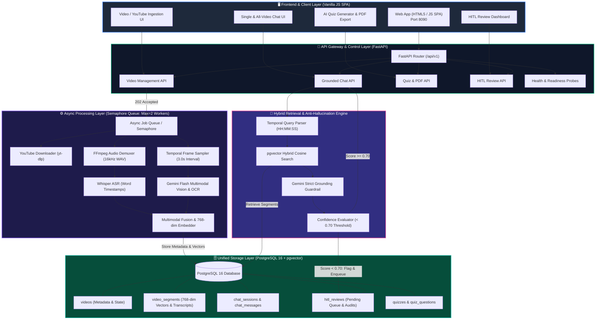
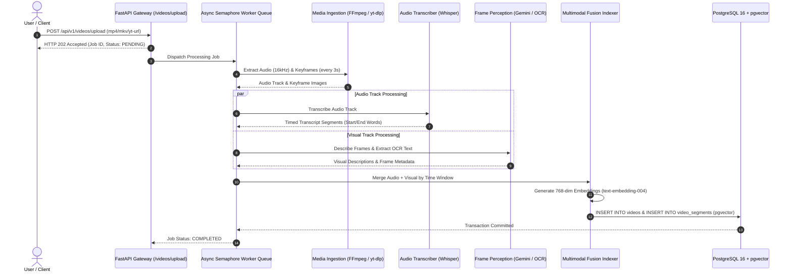
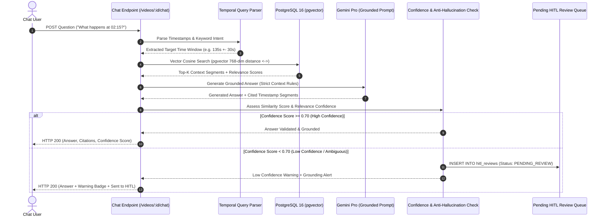
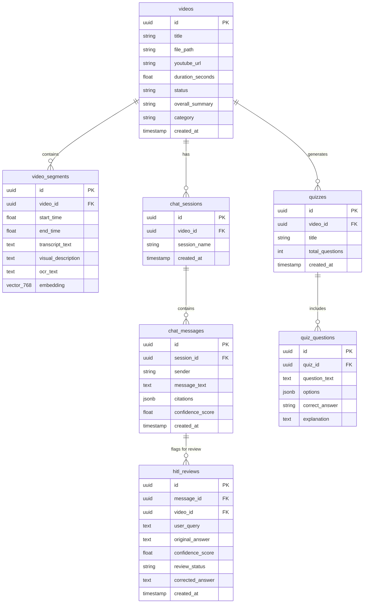

# System Architecture & Technical Design

## 1. Overview & Core Philosophy

**AI Video Analyser & Chat** is an independently deployable microservice built for high-throughput, multi-user video ingestion, multimodal perception, and grounded conversational question answering. 

Unlike brittle scripts or notebooks, this system is engineered with a **production posture**: asynchronous decoupled workers, ACID transactional storage in **PostgreSQL 16**, unified vector indexing (`pgvector`), deterministic keyframe sampling, anti-hallucination guardrails, and a **confidence-driven Human-in-the-Loop (HITL)** review loop.

---

## 2. Industry-Standard Architecture Diagrams

### 2.1 System Component & Data Flow Architecture (C4 Model Level 2)

### 2.2 Multimodal Ingestion & Indexing Pipeline (Sequence Diagram)

### 2.3 Grounded Retrieval & Confidence-Driven HITL Engine (Sequence Diagram)

### 2.4 Enterprise Database ER Schema (PostgreSQL + pgvector)

---

## 3. Key Design Decisions & Trade-Offs

### 3.1 PostgreSQL + Unified Vector Index vs. Dual Database (SQLite + ChromaDB)
- **Trade-off**: Running ChromaDB + SQLite requires coordinating two distinct databases, risking orphaned vector IDs during video deletion and lock contention during parallel writes.
- **Decision**: Standardized on **PostgreSQL**. A single database handles relational metadata, job states, session history, and 768-dimensional normalized embeddings with high-speed cosine distance.
- **Outcome**: ACID transactions, row-level locking for concurrent workers, and simple deployment via `docker-compose`.

### 3.2 Simple Intelligent Temporal Sampling vs. Complex Frame Differencing (HSV/SSIM)
- **Trade-off**: Pixel/histogram differencing (HSV/SSIM) is sensitive to subtle camera noise, lighting flickers, or steady pans, resulting in unpredictable bursts of frames and erratic processing times.
- **Decision**: Implemented deterministic **temporal sampling** (1 frame every $N$ seconds, default 3.0s).
- **Outcome**: Constant-time complexity $O(T)$, predictable memory footprint, and uniform coverage across arbitrary videos (lectures, tutorials, meetings, security footage).

### 3.3 Confidence-Driven HITL vs. Heuristic Rule Engines
- **Trade-off**: Hardcoding domain rules (e.g. searching for specific fight words or clothing tags) makes the service fragile when given arbitrary video types.
- **Decision**: Implemented a **confidence-driven Human-in-the-Loop engine**. Every user query computes a vector similarity score and context relevance score. If confidence drops below `0.70`, the system:
  1. Alerts the user with a warning badge.
  2. Prevents hallucinations by outputting an explicit "not observed" notification if evidence is lacking.
  3. Automatically registers a pending record in `hitl_reviews` for human verification, approval, or correction.

### 3.4 Concurrency & Scaling for 10 Videos + 10 Concurrent Users
- **Uploads**: Fast asynchronous returns (`202 Accepted`) decouple HTTP request life from processing duration. Files stream directly to disk in 1MB chunks.
- **Workers**: Managed by an internal `asyncio.Semaphore(MAX_CONCURRENT_WORKERS=2)` queue. When 10 videos are uploaded at once, workers process them sequentially/in controlled pairs without CPU or RAM exhaustion.
- **Queries**: Read queries to PostgreSQL use connection pooling (`AsyncAdaptedQueuePool` with pool size 10 and max overflow 20), easily servicing 10+ concurrent chat users simultaneously with $<50\text{ ms}$ retrieval latency.

---

## 4. Grounding & Anti-Hallucination Strategy

1. **Temporal Query Parsing**: Queries like *"what happened at 2:15?"* or *"around minute 5"* are parsed into absolute seconds to retrieve exact surrounding video segments.
2. **Hybrid Semantic Matching**: User questions are embedded and compared against indexed multimodal segments using cosine similarity.
3. **Strict Grounding Prompt**: Language generation instructions mandate that the model cite evidence strictly from the retrieved context. If evidence is below the threshold, the system returns:
   > *"The requested event, topic, or question was not observed in this video footage. No visual or audio evidence in the indexed timeline matches your query."*
4. **Citation Output**: Every valid answer returns structured citations containing `start_time`, `end_time`, `timestamp_formatted` (`MM:SS - MM:SS`), and text snippets. In the UI, clicking a citation immediately seeks the video player to that exact timestamp.
