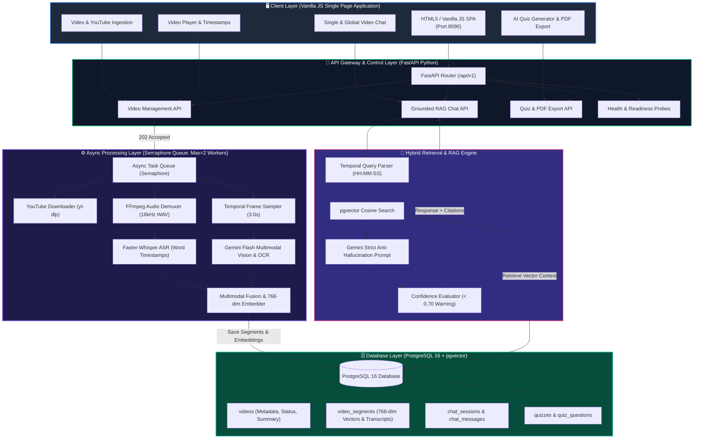
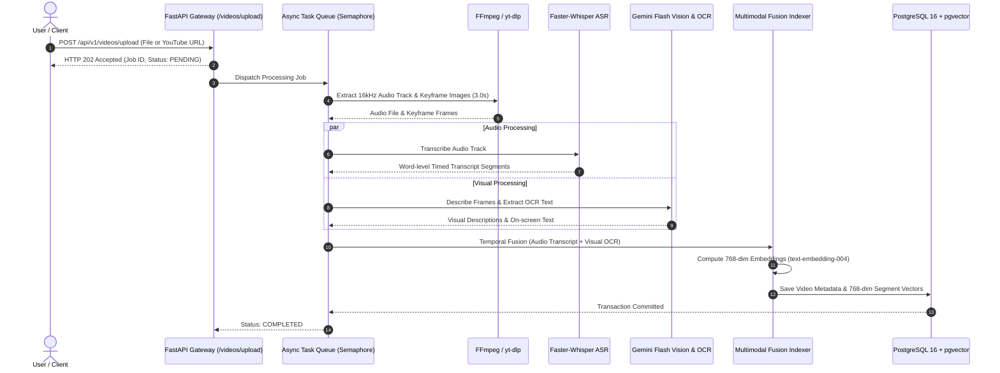
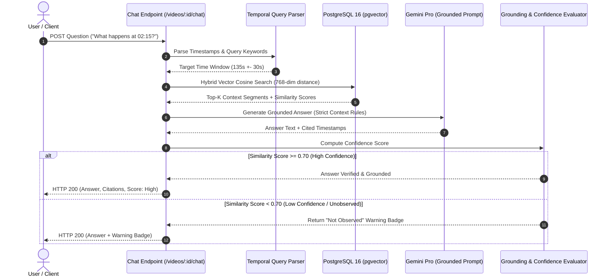
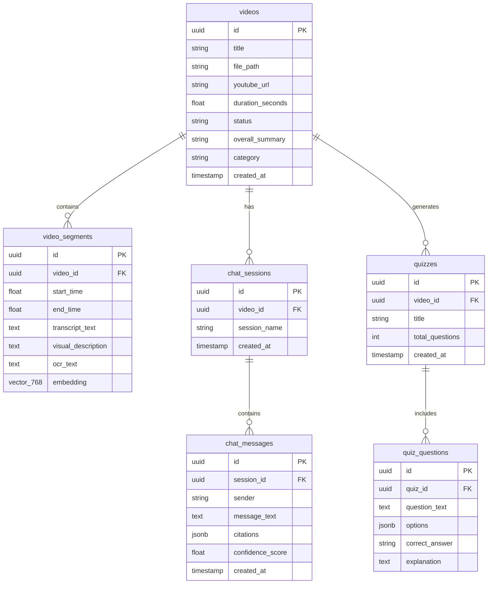

# System Architecture & Technical Design

## 1. Overview & Core Philosophy

**AI Video Analyser & Chat** is an independently deployable Python microservice built for high-throughput, multi-user video ingestion, multimodal perception, and grounded conversational question answering. 

Engineering Posture:
- **Frontend**: HTML5 / Vanilla JavaScript Single Page Application (SPA) with no heavy framework dependencies.
- **Backend**: Async non-blocking FastAPI (Python 3.10+).
- **Storage**: ACID transactional storage in **PostgreSQL 16** with vector similarity indexing (`pgvector`).
- **Processing**: Async worker queue with FFmpeg audio demuxing, Faster-Whisper ASR, Gemini Flash Vision & OCR, and 768-dim normalized embedding vectors (`text-embedding-004`).
- **RAG Engine**: Grounded retrieval with timestamp citations ($MM:SS$) and anti-hallucination guardrails.

---

## 2. System Architecture Diagrams

### 2.1 System Component & Data Flow Architecture (C4 Model Level 2)

### 2.2 Multimodal Ingestion & Indexing Pipeline (Sequence Diagram)

### 2.3 Grounded RAG Chat Engine (Sequence Diagram)

### 2.4 Enterprise Database ER Schema (PostgreSQL 16 + pgvector)

---

## 3. Key Design Decisions & Trade-Offs

### 3.1 PostgreSQL + Unified Vector Index vs. Dual Database (SQLite + ChromaDB)
- Standardized on **PostgreSQL 16**. A single database handles relational metadata, job states, session history, and 768-dimensional normalized embeddings via `pgvector` with cosine distance matching.

### 3.2 Intelligent Temporal Sampling (3.0s Interval)
- Implemented deterministic **temporal sampling** (1 frame every 3.0s). Constant-time complexity $O(T)$, predictable memory footprint, and uniform coverage across arbitrary videos.

### 3.3 Grounding & Anti-Hallucination Strategy
- Low-confidence responses ($< 0.70$) display a visual warning badge in the chat UI and trigger fallback messages to prevent hallucinations.
